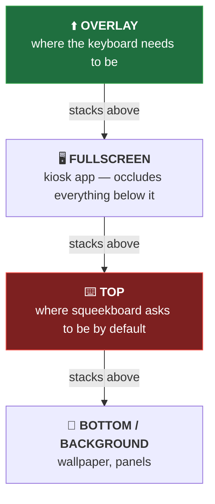
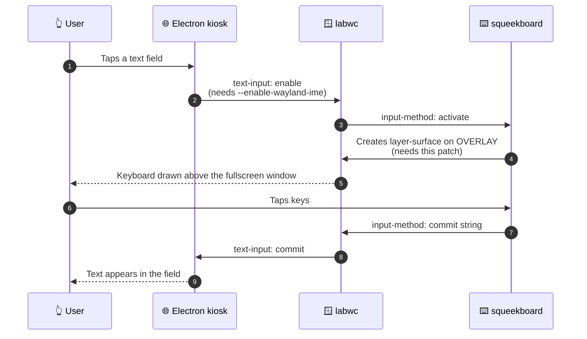

<div align="center">

# ⌨️ Squeekboard Overlay-Layer Patch

**A one-hunk patch that makes the [squeekboard](https://gitlab.gnome.org/World/Phosh/squeekboard) on-screen keyboard render above fullscreen Wayland apps.**


[](https://github.com/CaputoDavide93/Squeekboard-Overlay-Patch/actions/workflows/ci.yml)

</div>

---

## 🐛 The problem

On a Raspberry Pi kiosk running a fullscreen Electron/Chromium app under **labwc** (or any wlroots-based compositor), squeekboard is invisible. It starts, receives input-method events, and logs no errors — it is simply drawn behind the fullscreen window.

The cause is the Wayland layer-shell stacking order. Fullscreen surfaces sit *between* the `TOP` and `OVERLAY` layers, and squeekboard requests `TOP`:



There is no compositor-side setting that fixes this. The layer-shell protocol has no way to say *"let this fullscreen window hide the panel but not the keyboard"*, so the fix has to happen in squeekboard.

---

## 🔧 The fix

One constant in [`src/panel.c`](https://gitlab.gnome.org/World/Phosh/squeekboard/-/blob/master/src/panel.c):

```diff
-            "layer", ZWLR_LAYER_SHELL_V1_LAYER_TOP,
+            "layer", ZWLR_LAYER_SHELL_V1_LAYER_OVERLAY,
```

`OVERLAY` (layer `3`) stacks above fullscreen surfaces; `TOP` (layer `2`) does not. That single change is the whole patch.

> [!NOTE]
> This is a deliberate trade-off, not a bug fix. `TOP` is the correct layer for a phone or desktop — a keyboard should not cover system overlays or a lock screen. `OVERLAY` is correct for a locked-down kiosk. See [Why not upstream?](#-why-not-upstream) and [SECURITY.md](SECURITY.md).

---

## ✨ What's in here

| | File | What it does |
|---|---|---|
| 🩹 | [`overlay-layer.patch`](overlay-layer.patch) | The patch itself — one hunk against `src/panel.c` |
| 🛠️ | [`build.sh`](build.sh) | Checks prerequisites, fetches source, applies the patch, builds a `.deb` |
| 🤖 | [`.github/workflows/ci.yml`](.github/workflows/ci.yml) | Weekly upstream-drift check + `shellcheck` |
| 🔒 | [`SECURITY.md`](SECURITY.md) | Reporting, and the kiosk caveats of the `OVERLAY` layer |

---

## 🗺️ Architecture

The patch is only one link in the chain. For a keyboard to appear *and* type into an Electron app, the compositor, the app and squeekboard all have to cooperate:



Miss the patch and step 5 draws the keyboard where nobody can see it. Miss `--enable-wayland-ime` and step 2 never fires, so the keyboard never opens at all. Both are covered below.

---

## 🚀 Quick Start

### Option A — Automated build (on the Pi)

```bash
git clone https://github.com/CaputoDavide93/Squeekboard-Overlay-Patch.git
cd Squeekboard-Overlay-Patch
chmod +x build.sh
./build.sh
```

The script verifies APT source repositories are enabled, installs build dependencies, fetches the squeekboard source, applies the patch and builds a `.deb`. It takes ~15–30 minutes on a Pi 5, longer on a Pi 4, and prints the `dpkg -i` command to run at the end.

Both arguments are optional:

```bash
./build.sh [SQUEEKBOARD_VERSION] [WORK_DIR]
./build.sh 1.43.1-1+rpt1 ~/build      # defaults: 1.43.1-1+rpt1, a fresh mktemp dir
```

### Option B — Manual patch

```bash
# Get the source (needs deb-src enabled — see Troubleshooting)
apt-get source squeekboard
cd squeekboard-*/

# Apply the patch
patch -p1 < /path/to/overlay-layer.patch

# Build and install
dpkg-buildpackage -us -uc -b
sudo dpkg -i ../squeekboard_*.deb
```

Then restart the keyboard:

```bash
systemctl --user restart squeekboard
```

---

## ⚙️ Configuration

Rebuilding squeekboard makes the keyboard *visible*. These three pieces make it *work*.

### 1. Input-method environment variables

In your compositor's environment config (for labwc, `~/.config/labwc/environment`):

```bash
GTK_IM_MODULE=wayland
QT_IM_MODULE=wayland
```

### 2. Electron/Chromium IME flag

Chromium-based apps only speak the Wayland `text-input` protocol when explicitly told to. Without this flag the keyboard never opens, patched or not:

```bash
--enable-wayland-ime
```

For example, with [TouchKio](https://github.com/leukipp/touchkio):

```ini
# ~/.config/systemd/user/touchkio.service
[Service]
ExecStart=/usr/bin/touchkio --enable-wayland-ime --web-url=http://your-ha:8123/
```

### 3. squeekboard user service

```ini
# ~/.config/systemd/user/squeekboard.service
[Unit]
Description=squeekboard on-screen keyboard
After=touchkio.service
Wants=touchkio.service

[Service]
Type=simple
ExecStartPre=/bin/sleep 3
ExecStart=/usr/bin/squeekboard
Restart=on-failure
RestartSec=5
Environment=XDG_RUNTIME_DIR=/run/user/%U
Environment=WAYLAND_DISPLAY=wayland-0
Environment=GDK_BACKEND=wayland
Environment=GTK_THEME=Adwaita:dark

[Install]
WantedBy=default.target
```

```bash
systemctl --user enable --now squeekboard.service
```

> [!TIP]
> `ExecStartPre=/bin/sleep 3` lets the compositor and kiosk app settle before squeekboard binds its layer surface. Without it, squeekboard can start before the compositor is accepting layer-shell clients.

---

## 📁 Repo structure

```text
Squeekboard-Overlay-Patch/
├── .github/
│   └── workflows/
│       └── ci.yml          # 🤖 upstream-drift check + shellcheck
├── .gitignore              # 🚫 ignores built .deb / extracted source
├── overlay-layer.patch     # 🩹 the patch (one hunk, src/panel.c)
├── build.sh                # 🛠️ fetch source → patch → build .deb
├── SECURITY.md             # 🔒 reporting + OVERLAY-layer caveats
├── LICENSE                 # 📄 GPLv3, matching upstream squeekboard
└── README.md               # 📖 this file
```

---

## 🧪 Testing

There is no unit-test suite — this repo is a patch and a build script. CI verifies the two things that can actually rot:

| | Check | Why |
|---|---|---|
| 🩹 | `patch -p1 --dry-run` against **upstream** and the **raspberrypi-ui fork**, then asserts the result selects `OVERLAY` and no longer references `TOP` | A patch that no longer applies is worse than no patch |
| 🐚 | `shellcheck build.sh` | The build script runs `sudo` — it should be clean |

The patch job also runs on a **weekly schedule**, so if squeekboard changes `src/panel.c` upstream, CI goes red before anyone hits it on a Pi.

Run the same checks locally:

```bash
mkdir -p /tmp/sq/src
curl -fsSL https://gitlab.gnome.org/World/Phosh/squeekboard/-/raw/master/src/panel.c \
  -o /tmp/sq/src/panel.c
(cd /tmp/sq && patch -p1 --dry-run < ~/Squeekboard-Overlay-Patch/overlay-layer.patch)
shellcheck build.sh
```

---

## 🛠️ Troubleshooting

<details>
<summary><b>The keyboard still isn't visible after installing</b></summary>

Confirm the running binary is actually the patched one — a `dpkg -i` that failed, or an `apt upgrade` afterwards, silently restores the stock package:

```bash
systemctl --user restart squeekboard
dpkg -l squeekboard            # is the version the one you built?
apt-mark hold squeekboard      # stop apt replacing it later
```

If it is patched and still hidden, your compositor may place its own surfaces above `OVERLAY`. Check what layer the kiosk app requests — a fullscreen *layer-shell* surface on `OVERLAY` will tie with the keyboard rather than sit below it.
</details>

<details>
<summary><b>The keyboard appears, but typing does nothing</b></summary>

That is the input-method chain, not this patch — the keyboard is drawing but no `text-input` connection exists. Check, in order:

1. The app is launched with `--enable-wayland-ime`.
2. `GTK_IM_MODULE=wayland` / `QT_IM_MODULE=wayland` are set in the compositor environment (not just your shell profile — the compositor must inherit them).
3. `systemctl --user status squeekboard` shows it running under the same `WAYLAND_DISPLAY` as the compositor.
</details>

<details>
<summary><b><code>patch: **** malformed patch</code> or hunk failures</b></summary>

Apply from the root of the extracted source tree — the patch uses `a/src/panel.c` paths and expects `-p1`:

```bash
cd squeekboard-*/          # not the parent directory
patch -p1 < overlay-layer.patch
```

If the hunk genuinely fails, upstream may have changed `src/panel.c`. Check the [CI status](https://github.com/CaputoDavide93/Squeekboard-Overlay-Patch/actions/workflows/ci.yml) — if it is red, the patch needs regenerating; please open an issue.
</details>

<details>
<summary><b><code>apt-get source</code> or <code>build-dep</code> fails</b></summary>

Source repositories are not enabled by default on Debian/Raspberry Pi OS. `build.sh` checks this and prints the fix; manually:

```bash
# Raspberry Pi OS Trixie / Debian 13+ (deb822 format)
sudo sed -i 's/^Types: deb$/Types: deb deb-src/' \
    /etc/apt/sources.list.d/debian.sources \
    /etc/apt/sources.list.d/raspi.sources

# Older releases: uncomment the deb-src lines in /etc/apt/sources.list

sudo apt-get update
```
</details>

---

## ✅ Tested on

| Component | Version |
|---|---|
| Raspberry Pi | 5 (arm64) |
| OS | Raspberry Pi OS (Debian Trixie) |
| Compositor | labwc 0.9.x |
| squeekboard | 1.43.1-1+rpt1 |
| Kiosk app | TouchKio (Electron) |
| Home Assistant | 2026.2.x |

---

## 🧭 Why not upstream?

This patch makes squeekboard *always* use the overlay layer, which is right for a fullscreen kiosk and wrong for a general-purpose device — on a phone or desktop the keyboard should not cover system overlays or a lock screen. That unconditional behaviour is why it lives here as a patch rather than a pull request.

The upstream-shaped fix would be a runtime option (e.g. `--layer=overlay` or a GSetting), letting kiosk builds opt in without changing the default. Relevant issues:

- [raspberrypi-ui/squeekboard#13](https://github.com/raspberrypi-ui/squeekboard/issues/13) — squeekboard invisible in fullscreen; forcing layer 3 confirmed as the fix (**open**)
- [labwc/labwc#2926](https://github.com/labwc/labwc/issues/2926) — squeekboard not visible over fullscreen Chromium (**closed**, no compositor-side option added)
- [labwc/labwc#1873](https://github.com/labwc/labwc/issues/1873) — virtual keyboard discussion

---

## 🔒 Security

`build.sh` uses `sudo` to install build dependencies, and the resulting `.deb` is unsigned (`-us -uc`). The `OVERLAY` layer also has a real consequence on non-kiosk systems: it can draw above a lock screen. Both are documented in [SECURITY.md](SECURITY.md), along with how to report a vulnerability.

---

## 📄 License

[GPLv3](LICENSE) — the same license as [squeekboard](https://gitlab.gnome.org/World/Phosh/squeekboard/-/blob/master/COPYING), since this repo distributes a patch against its source.

---

<p align="center">⭐ <b>If this tool helped you, please give it a star!</b> ⭐&ensp;·&ensp;<sub>Made with ❤️ by <a href="https://github.com/CaputoDavide93">Davide Caputo</a></sub></p>
